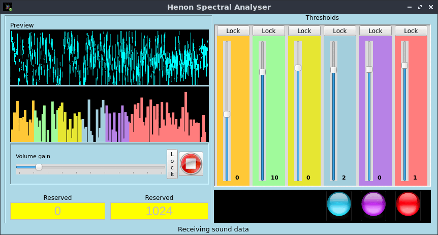

# glspectrum
A FFT spectral analyser and event trigger for the Henon Dynamic Microscope Transforms frequebcy-based sound data into threshold triggered commands to an external graphic generator through a TCP socket connection.
<h3>In a nutshell</h3>
Glspectrum is an application written in Python 3 that samples sound data from the computer's input channels (microphone, sound card, bluetooth, etc.), performs a standard Fast Fourier Transformation of that data and renders the frequency data in a buffer. &nbsp; 

<!--/div--> 

This module is an experimental addition to the soon to be published Henon Dynamic Microscope. The module's objective is to demonstate ways
of 
<ul><li>capturing data from the computer's various sound inputs,</li><li>performing an FFT analysis of that data,</li><li>firing triggers when defined thresholds are crossed</li><li>communicating with an external program across a network</li></ul>

In the glstectrum module there is a lot of talk about buttons. Buttons are, in fact the central intelligence within the module.
Each button is calibrated for a specific frecrency range. They are defined in the setupUI() function of the user interface.

In this program we have empirically defined 6 specific frequency ranges, each assigned to a specific color, threshold and rgb tuple :

<ul><li>self.init_button(self.btn_subbass, color='orange', min=30, max=150, threshold=0.03, rgb=(255,200,55)...</li><li>self.init_button(self.btn_bass, 'lightgreen', 151, 270, 0.03, (160,250,155)...</li><li>self.init_button(self.btn_lowmid, 'yellow', 271, 390, 0.03, (230, 230, 50)...</li><li>self.init_button(self.btn_highmid, 'cyan', 391, 510, 0.03, (163, 206, 220)...</li><li>self.init_button(self.btn_treble, 'plum', 511, 630, 0.03, (183, 130, 230)...</li><li>self.init_button(self.btn_hightreble, 'red', 631, 1023, 0.03, (255, 125, 125)...</li></ul>

 

